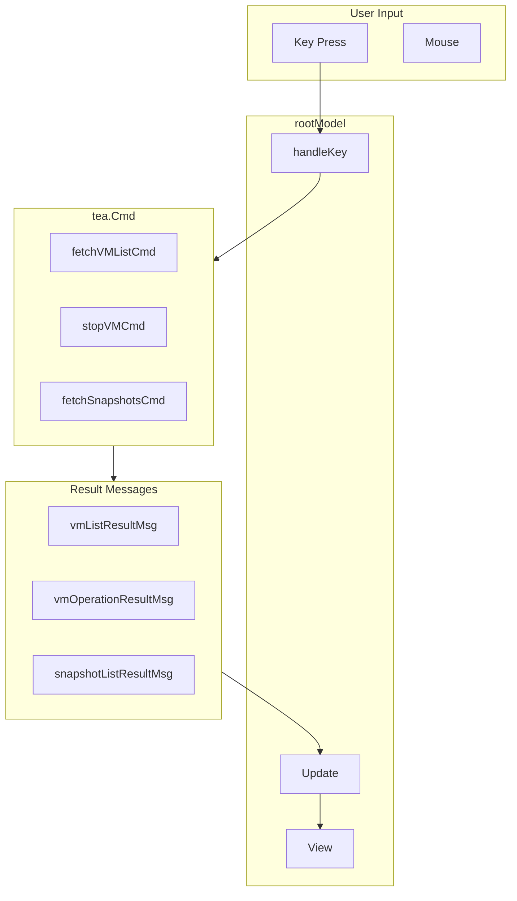

# PassGo Architecture

High-level overview for developers and LLMs working with the codebase.

## Data Flow

1. User presses a key → `handleKey` in main.go
2. Handler returns a `tea.Cmd` (e.g. `fetchVMListCmd`, `stopVMCmd`)
3. Bubble Tea runs the cmd asynchronously; it eventually produces a typed `*Msg`
4. `rootModel.Update(msg)` receives the message and updates state
5. On result messages, `currentView` may change; `View()` renders the active child model

## File Map

| File | Purpose |
|------|---------|
| main.go | Root model, view routing, handleKey, setChildSizes, Init, Update, View |
| messages.go | All tea.Msg types and tea.Cmd factories for async operations |
| view_table.go | Main VM table, filter, sorting, toasts, busy indicators |
| view_info.go | VM detail view with CPU/memory charts |
| view_create.go | Advanced VM creation form (cloud-init, resources) |
| view_modals.go | Help, version, error, and confirm modals |
| view_loading.go | Loading spinner overlay |
| view_snapshots.go | Snapshot create and manage views |
| view_mounts.go | Mount manage, add, and modify views |
| styles.go | Lipgloss styles; rebuildStyles() when theme changes |
| themes.go | Theme definitions, currentTheme(), setTheme() |
| multipass.go | Multipass CLI wrapper, cloud-init scanning, repo cloning |
| parsing.go | VMInfo, SnapshotInfo, parseVMInfo, parseSnapshots, parseVMNames |
| mount_operations.go | Mount JSON parsing (getVMMounts) for multipass info --format json |
| constants.go | VM defaults, limits, naming config, Ubuntu releases |
| utils.go | truncateToRunes, randomString |
| version.go | GetVersion() for build info |
| vm_operations.go | (Stub; VM logic in multipass.go and messages.go) |
| snapshot_operations.go | (Stub; snapshot logic in multipass.go and messages.go) |

## Message Flow

All messages are handled in `main.go`'s `Update()`. Who produces them:

| Message | Produced By | Handled In |
|---------|-------------|------------|
| vmListResultMsg | fetchVMListCmd, fetchVMListBackgroundCmd | main.Update |
| vmOperationResultMsg | stop/start/suspend/delete/recover/create/mount/umount cmds | main.Update |
| vmInfoResultMsg | fetchVMInfoCmd | main.Update (delegates to infoModel when on viewInfo) |
| snapshotListResultMsg | fetchSnapshotsCmd | main.Update |
| mountListResultMsg | fetchMountsCmd | main.Update |
| shellFinishedMsg | tea.ExecProcess callback (shell exit) | main.Update |
| confirmResultMsg | confirmModel (y/n, Enter) | main.Update |
| backToTableMsg | view_info, view_create, view_snapshots, view_mounts | main.Update |
| advCreateMsg | view_create (form submit) | main.Update |
| mountAddRequestMsg | view_mounts (mountManageModel) | main.Update |
| mountModifyRequestMsg | view_mounts (mountManageModel) | main.Update |
| mountModifySubmitMsg | view_mounts (mountModifyModel) | main.Update |
| toastExpireMsg | tableModel (toast timer) | main.Update (always routes to table) |
| autoRefreshTickMsg | autoRefreshTickCmd (tea.Tick) | main.Update |
| infoRefreshTickMsg | infoRefreshTickCmd (tea.Tick) | main.Update (when on viewInfo) |

## View State Machine

`viewState` determines which child model is active and rendered. Call `setChildSizes()` when creating a child or switching views.

| viewState | Model | Keys | Notes |
|-----------|-------|------|-------|
| viewTable | tableModel | All shortcuts (h, c, C, [, ], p, d, r, s, n, m, M, etc.) | Main VM list |
| viewHelp | helpModel | esc, enter, q | Read-only |
| viewVersion | versionModel | esc, enter, q | Read-only |
| viewInfo | infoModel | esc, i (refresh) | VM detail, live charts |
| viewLoading | loadingModel | (none) | Spinner; transitions on result msg |
| viewError | errorModel | esc, enter | Modal overlay |
| viewConfirm | confirmModel | y/n, left/right, enter | Yes/No for destructive ops |
| viewAdvCreate | advCreateModel | Form navigation, Enter, Esc | Advanced create form |
| viewSnapCreate | snapCreateModel | Form navigation | Create snapshot |
| viewSnapManage | snapManageModel | n (create), e (restore), d (delete), Esc | Snapshot tree |
| viewMountManage | mountManageModel | a (add), e (modify), d (remove), Esc | Mount list |
| viewMountAdd | mountAddModel | Form navigation | Add mount |
| viewMountModify | mountModifyModel | Form navigation | Modify mount |

## Key Conventions

- **Async ops**: Define Msg type in messages.go; return tea.Cmd that produces it. Root handles in Update.
- **Child models**: Receive width/height; call `setChildSizes()` when creating or on WindowSizeMsg.
- **Inline ops**: Set `busyVMs[name]` before cmd; clear on `vmOperationResultMsg`. User stays on table.
- **Context return**: `lastMountVM` and `lastSnapVM` track where to return after mount/snapshot ops complete.
