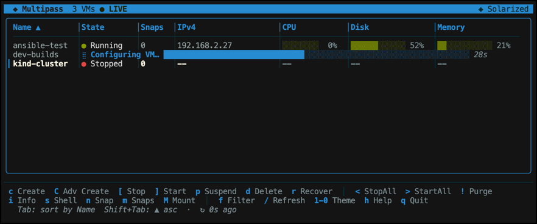
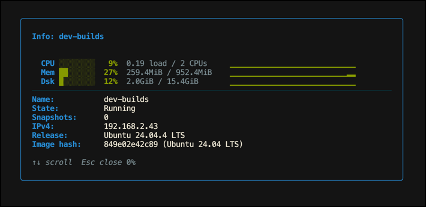

# PassGo - Multipass VM Manager

A terminal-based GUI for managing Multipass VMs with snapshot support.





## Features

- **VM Management**: Start, stop, suspend, delete VMs
- **Snapshot Support**: Create, manage, revert, and delete snapshots
- **Cloud-init Support**: Automatically detect local YAMLs and optional GitHub repo templates
- **Interactive UI**: Terminal-based interface with keyboard shortcuts
- **Multi-platform**: Supports Linux, macOS, and Windows
- **Optimized Binaries**: UPX-compressed for smaller download sizes

## Cloud-init Configuration

PassGo automatically detects cloud-init YAML files in the same directory as the binary and allows you to use them when creating new VMs.

In addition, you can point PassGo at a GitHub repository of cloud-init templates via a local `.config` file. Those repo templates will appear alongside local templates in Advanced Create.

### Setting Up Cloud-init Files

1. **Create a YAML file** in the same directory as the `passgo` binary
2. **Start with `#cloud-config`** as the first line
3. **Use standard cloud-init syntax** for configuration

### Example Cloud-init File

Create a file named `my-config.yml`:

```yaml
#cloud-config
package_update: true
package_upgrade: true

packages:
  - curl
  - wget
  - git
  - vim
  - htop

users:
  - name: ubuntu
    sudo: ALL=(ALL) NOPASSWD:ALL
    shell: /bin/bash

runcmd:
  - echo "Hello from cloud-init!" > /tmp/cloud-init-test.txt
  - chmod 644 /tmp/cloud-init-test.txt

final_message: "Cloud-init configuration completed successfully!"
```

### Using Cloud-init Files

1. **Place your YAML file** in the same directory as the `passgo` binary
2. **Press `C`** for Advanced Create (not `c` for Quick Create)
3. **Select your cloud-init file** from the dropdown menu
4. **Configure other VM settings** (CPU, RAM, disk, etc.)
5. **Press Create** to launch the VM with your cloud-init configuration

### Using Templates from a GitHub Repository (.config)

You can add a hidden `.config` file next to the `passgo` binary to pull templates from a GitHub repository:

1. Create a file named `.config` in the same directory as `passgo`
2. Add a line specifying your repo URL (with or without a leading `@`):

```
github-cloud-init-repo=@https://github.com/iaingblack/cloud-init-templates
```

3. Press `C` (Advanced Create). The Cloud-init File dropdown will list:
   - “None”
   - Local YAMLs in the current folder
   - Repo YAMLs, labeled as `repo/<path-in-repo>.yml`

Notes:
- The repo is cloned shallowly to a temporary directory each time the Advanced Create form is opened.
- All `.yml`/`.yaml` files in the repo are shown. Local files still require `#cloud-config` as the first line.
- Example repo: [cloud-init-templates](https://github.com/iaingblack/cloud-init-templates)

### Supported Cloud-init Features

PassGo supports all standard cloud-init modules, including:

- **Package Management**: Install packages and update the system
- **User Management**: Create users, set passwords, configure SSH keys
- **File Operations**: Create files, directories, and manage permissions
- **Commands**: Run custom commands during boot
- **Network Configuration**: Configure network interfaces
- **And much more**: See the [cloud-init documentation](https://cloudinit.readthedocs.io/) for complete feature list

### File Detection

PassGo scans for templates in two places:

- Local directory (same folder as `passgo`): files must:
  - have `.yml` or `.yaml` extensions, and
  - have first line exactly `#cloud-config`

- Optional GitHub repo (configured via `.config`):
  - all `.yml`/`.yaml` files are listed (no header requirement)

If no cloud-init files are found, the dropdown will only show "None" for standard VM creation.

### Logging

PassGo writes a log file to `~/.passgo/passgo.log` with entries for:
- Startup
- Reading `.config`
- Repo cloning and number of templates found
- Multipass command executions and any errors
- Cleanup of temporary directories

## Installation

### Download Pre-built Binaries

Download the latest release from the [Releases page](https://github.com/rootisgod/passgo/releases):

- **Linux**: `passgo-linux-amd64` or `passgo-linux-arm64`
- **macOS**: `passgo-darwin-amd64` or `passgo-darwin-arm64`
- **Windows**: `passgo-windows-amd64.exe`

### Build from Source

```bash
# Clone the repository
git clone https://github.com/rootisgod/passgo.git
cd passgo

# Install dependencies
go mod download

# Build
go build -o passgo

# Or run directly
go run .
```

## Usage

### Keyboard Shortcuts

- `h` - Help
- `c` - Quick Create VM (basic configuration)
- `C` - Advanced Create VM (with cloud-init support)
- `[` - Stop selected VM
- `]` - Start selected VM
- `p` - Suspend selected VM
- `<` - Stop all VMs
- `>` - Start all VMs
- `d` - Delete selected VM
- `r` - Recover deleted VM
- `!` - Purge all VMs
- `/` - Refresh VM list
- `s` - Shell into VM
- `n` - Create snapshot
- `m` - Manage snapshots
- `v` - Show version
- `q` - Quit

### Snapshot Operations

Snapshot operations are only available on stopped VMs:

1. Select a stopped VM
2. Press `n` to create a snapshot or `m` to manage existing snapshots
3. Follow the on-screen prompts

## Development

### Prerequisites

- Go 1.24 or later
- Multipass installed and configured

### Building Multi-platform Binaries

```bash
# Linux
GOOS=linux GOARCH=amd64 go build -o passgo-linux-amd64 .
GOOS=linux GOARCH=arm64 go build -o passgo-linux-arm64 .

# macOS
GOOS=darwin GOARCH=amd64 go build -o passgo-darwin-amd64 .
GOOS=darwin GOARCH=arm64 go build -o passgo-darwin-arm64 .

# Windows
GOOS=windows GOARCH=amd64 go build -o passgo-windows-amd64.exe .
GOOS=windows GOARCH=arm64 go build -o passgo-windows-arm64.exe .
```

### Optimizing Binaries with UPX

```bash
# Install UPX
brew install upx  # macOS
sudo apt install upx-ucl  # Ubuntu/Debian
choco install upx  # Windows

# Compress binaries
upx --best --lzma passgo-*
```

## Automated Releases

This project uses GitHub Actions to automatically build and release binaries for all supported platforms when code is pushed to the main branch. Each release includes:

- Optimized binaries for Linux (amd64, arm64)
- Optimized binaries for macOS (amd64, arm64)
- Optimized binaries for Windows (amd64, arm64)
- SHA256 checksums for verification

## License

This project is open source. Please check the license file for details.
